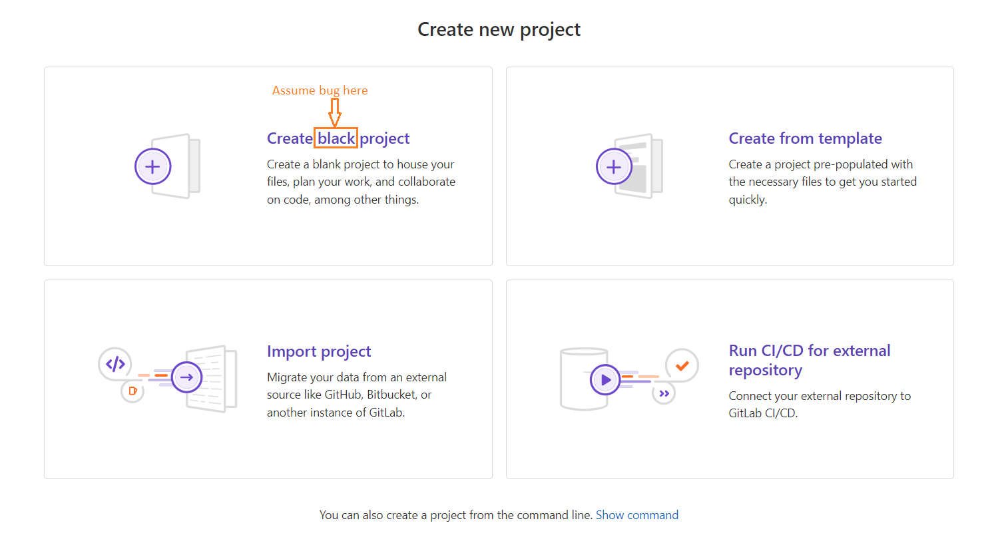

## Summary (Summarize the bug encountered concisely)
     
     UI Text Error – Incorrect label "Create black project" instead of "Create blank project" on the New Project page.

## Steps to reproduce

     1. Navigate to the GitLab project creation page: https://gitlab.com/projects/new#blank_project

     2. Scroll down to the section titled "Create blank project".

     3. Observe the text on the main button or the header of the blank project panel

## What is the current bug behavior?

     The application displays the text "Create black project".

     This is a typographical error; the intended word is "blank".

## What is the expected correct behavior?

     The application should display "Create blank project".

## Relevant logs and/or screenshots

## Possible fixes

     A developer likely made a typo in the front-end locale or view file. 
     
     1. Search the codebase for the string "Create black project".

     2. Replace it with "Create blank project".

## Whom do you report/ Assign To/ Tags

     /label ~bug ~UI ~low-priority ~needs-investigation
     /cc @project-manager
     /assign @frontend-developer

## Priority

     Trivial: This bug does not cause a crash, data loss, or security issue. It is a simple text misspelling. However, it should be fixed because "Black project" is confusing to users.